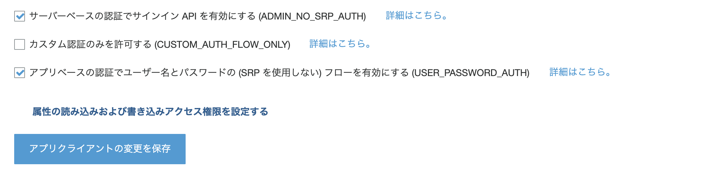
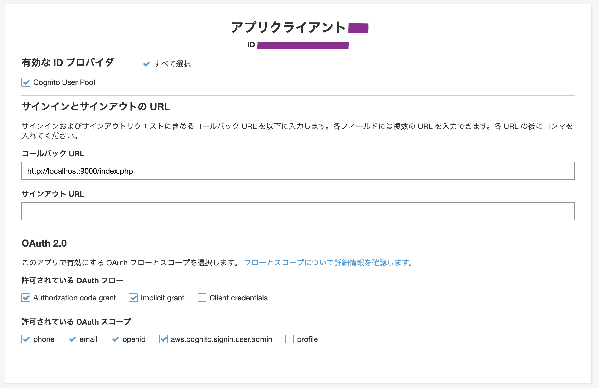

# Cognito

サーバーでの認証 ADMIN_NO_SRP_AUTH を有効にした場合, `SECRET_HASH` を含める必要がある.



- https://stackoverflow.com/questions/50337252/aws-cognito-refresh-token-fails-on-secret-hash
- https://docs.aws.amazon.com/cognito/latest/developerguide/amazon-cognito-user-pools-authentication-flow.html?icmpid=docs_cognito_console#amazon-cognito-user-pools-admin-authentication-flow

---



ブラウザからデバッグ的にログインする場合, 
Implicit code grant (暗黙的コードの付与) にチェックを入れる.

`&scope=aws.cognito.signin.user.admin` で, access_token のみが返ってくる.

### サンプルURL

```bash
https://<yourdomain>.auth.ap-northeast-1.amazoncognito.com/oauth2/authorize?
response_type=token
&client_id=xxx
&redirect_uri=http://localhost:9000/index.php
&scope=aws.cognito.signin.user.admin
```

### レスポンス例

```bash
http://localhost:9000/index.php#access_token=xxx&token_type=Bearer&expires_in=3600
```

- https://docs.aws.amazon.com/ja_jp/cognito/latest/developerguide/cognito-user-pools-app-idp-settings.html
